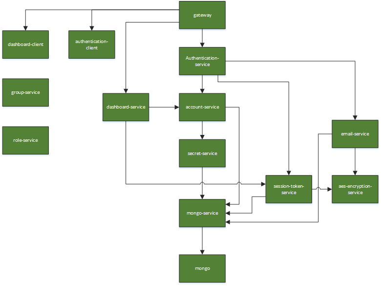
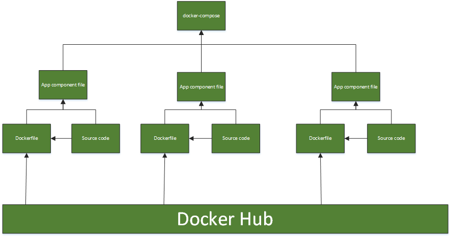

<<<<<<< HEAD
readme
=======
# How the app works

The purpose of this app is to provide a secure login and register function that can be easily attached to other projects.

Below is a flow diagram that shows how the different components depend on each other.

# Docker

This project can be deployed using Docker and docker-compose. to do this simply cd into the Docker file and run "docker-compose up -d". This will cause the program to pull, build and deploy all of components of the project.

The Docker images created in this process can also be pushed to Docker hub so they can be pulled and used by other applications without needing to obtain the original code and build their own Docker image.

Once running go to http://[externalIP]/authentication/login to access the login app.

To stop the Docker images from running run "docker-compose down"

# kubernetes

In addition to Docker to project can be deployed with kubernetes. Before you do this however, you need to create a cluster that will hold the pods, services and load balancer. This can be done with the command "gcloud component clusters create [cluster name]".
The next step will require the Docker images mentioned above to be pushed to Docker hub. Once this is done cd into the kube file and run "kubectl apply -f . ". This command will deploy all of the .yaml files inside the kube file. We are using the "apply2 command rather than the "create" command as apply allows for the components to be updated and deployed by rerunning the "kubectl apply -f . ".

Once deployed run "kubectl get svc" to get a list of services, here you should find the external-IP for the load balancer (it may take a few minuets for the external-IP to be generated so you might see "<pending>" where the IP should be).

When the external-IP has been generated to application will be running on http://[externalIP]/authentication/login .

# Jenkins

Jenkins can be used to automate the deployment of the project. However because we are using Docker and kubernetes we need give Jenkins these functions. This is where the jenk file comes in.

This file has more .yaml files that can be run with kubernetes as before with "kubectl apply -f .". Again, as before, run "kubectl get svc" to get the external-IP for Jenkins and go to ttp://[externalIP]:8080 to interact with Jenkins.

The project can then be deployed from Jenkins by creating a job that runs to following script:

"""
git init
git pull https://github.com/BenM96/loginFull
kubectl apply -f ./kube
"""

You can then access the project as before.

Web hooks can also be used to run the Jenkins job whenever this GitHub is updated.

